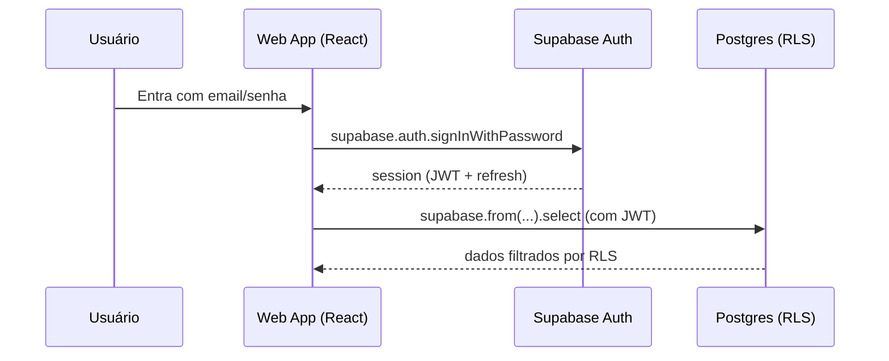
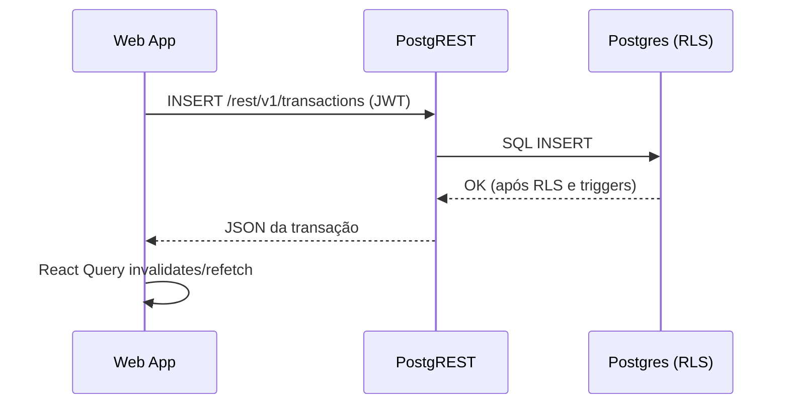

## Arquitetura do projeto (visão para arquitetos)

Este documento descreve a arquitetura **de ponta a ponta** do sistema, com foco em:

- como o frontend é organizado;
- como acontece a comunicação **Front ↔ “Back” (Supabase)**;
- como e onde os dados são persistidos;
- como a segurança é aplicada (Auth + RLS + Service Role em Edge Functions).

> Contexto: este é um app React (Vite) que usa **Supabase como BaaS** (Postgres + Auth + Storage + Edge Functions).
> Não existe um “backend” tradicional hospedado separadamente; a camada server-side é composta por recursos do Supabase.

### Diagrama de alto nível

```mermaid
flowchart LR
  subgraph Client
    App[App (`src/App.tsx`)] --> Router[BrowserRouter]
    Router --> Pages[Pages (`src/pages/*`)]
    Pages --> Components[UI Components (`src/components/*`)]
  end

  Components --> Hooks[Hooks (`src/hooks/*`)]
  Components --> Contexts[Contexts (`src/contexts/*`)]
  Hooks --> ReactQuery[React Query (`@tanstack/react-query`)]
  ReactQuery --> SupabaseClient[Supabase client (`src/integrations/supabase/client.ts`)]

  SupabaseClient --> PostgREST[PostgREST (REST sobre Postgres)]
  SupabaseClient --> RPC[RPC (funções SQL via `.rpc()`)]
  SupabaseClient --> EdgeFuncs[Edge Functions (`supabase/functions/*`)]
  EdgeFuncs --> External[Integrações externas (Stripe, WhatsApp/Evolution API)]

  subgraph Supabase
    Auth[Supabase Auth]
    DB[(Postgres + RLS)]
    Storage[Storage (ex: avatars)]
  end

  PostgREST --> DB
  RPC --> DB
  SupabaseClient --> Auth
  SupabaseClient --> Storage

  subgraph UI_Primitives
    Radix[Radix UI] --> Components
    Tailwind[Tailwind CSS + CVA] --> Components
  end

  subgraph Utils
    Lib[`src/lib/*`] --> Hooks
    Utils[`src/utils/*`] --> Components
  end

  classDef box stroke:#333,stroke-width:1px,fill:#f8f9fa;
  class App,Router,Pages,Components,Hooks,ReactQuery,SupabaseClient,Contexts box;
```

---

## 1) Componentes e camadas

### 1.1 Frontend (React + Vite)

- **Bootstrap**: `src/main.tsx` inicializa React e Providers.
- **Aplicação/rotas**: `src/App.tsx` registra rotas (via `BrowserRouter`) e organiza a navegação por páginas.
- **Páginas**: `src/pages/*` (ex.: `Home`, `Transactions`, `Goals`, `Cards`, `Settings`).
- **Componentes**: `src/components/*` (inclui UI, dialogs e peças de domínio como transações/cartões/metas).
- **Estado global**: `src/contexts/*` (tema, modo do app, sidebar, etc.).
- **Acesso a dados**: `src/hooks/*` encapsula queries/mutations e integra com caching.

### 1.2 Camada de dados no cliente

O projeto usa dois padrões principais:

1) **React Query** (`@tanstack/react-query`) para:
   - cache de consultas;
   - invalidação/refetch após mutations;
   - estado de carregamento/erro padronizado.
2) **Cliente Supabase JS** para:
   - autenticação (JWT);
   - acesso a tabelas Postgres via PostgREST (`supabase.from(...).select/insert/update/delete`);
   - chamadas RPC (`supabase.rpc(...)`);
   - chamadas a Edge Functions (`supabase.functions.invoke(...)`).

O cliente Supabase está em `src/integrations/supabase/client.ts` e usa:

- `VITE_SUPABASE_URL`
- `VITE_SUPABASE_PUBLISHABLE_KEY`
- armazenamento de sessão em `localStorage` (persistSession + autoRefreshToken)

### 1.4 Ambientes (dev local vs cloud)

Este projeto permite rodar o **frontend em modo dev (Vite)**, mas escolhendo se as chamadas vão para:

- **Supabase Cloud (prod)**: útil para testar a UI em modo dev usando o backend real.
- **Supabase local**: útil para desenvolvimento isolado e testes locais.

Estratégia usada (Vite env files):

- `.env` (versionado): contém `VITE_SUPABASE_URL` e `VITE_SUPABASE_PUBLISHABLE_KEY` do **Supabase Cloud**.
- `.env.local` (gitignored): é carregado em qualquer modo; mantemos vazio por padrão para não “forçar” um ambiente.
- `.env.development.local` (gitignored): contém overrides do **Supabase local** e só é carregado em `--mode development`.

Scripts:

- `npm run dev` (ou `npm run dev:prod`): sobe o Vite dev server usando Supabase Cloud.
- `npm run dev:local`: sobe o Vite dev server usando Supabase local.

⚠️ Atenção: ao usar Supabase Cloud em dev, você pode criar/alterar dados reais e também acionar Stripe Live.
Recomendação: use um usuário de teste dedicado e, no Stripe, prefira trial/cupom para validar o fluxo.

### 1.3 “Backend” (Supabase)

No Supabase, as responsabilidades ficam distribuídas assim:

- **Auth**: criação/login/logout, emissão e rotação de JWT.
- **Database (Postgres)**: tabelas de domínio, funções e triggers.
- **RLS (Row Level Security)**: políticas por tabela restringindo acesso por `auth.uid()` e/ou `household_id`.
- **Edge Functions**: endpoints serverless para integrações externas e rotinas administrativas (Stripe, WhatsApp, cron, etc.).
- **Storage**: bucket(s) para arquivos (ex.: avatars) com políticas de acesso.

---

## 2) Comunicação Front ↔ Supabase

### 2.1 Chamadas “diretas” ao banco (PostgREST)

O fluxo mais comum é o frontend chamar:

```ts
supabase.from("transactions").select(...)
```

Isso vira uma chamada HTTP para o endpoint REST do Supabase (PostgREST). O Supabase então:

1) valida o JWT (quando presente);
2) executa o SQL equivalente no Postgres;
3) aplica as políticas de RLS;
4) retorna o JSON.

Pontos importantes:

- **RLS é o “firewall” do banco**: mesmo que o front tente consultar `transactions` de outro usuário, o Postgres bloqueia se a policy não permitir.
- O modelo de autorização padrão usa `auth.uid()` comparado com colunas como `user_id` e/ou `household_id`.

### 2.2 Autenticação (JWT no cliente)

O estado de autenticação é gerenciado em `src/hooks/useAuth.tsx` via:

- `supabase.auth.onAuthStateChange(...)`
- `supabase.auth.getSession()`
- `supabase.auth.signUp(...)`, `signInWithPassword(...)`, `signOut()`

O JWT da sessão é anexado automaticamente nas chamadas do Supabase JS, quando a sessão está ativa.

### 2.3 RPC (funções SQL)

Quando há lógica que faz sentido ficar no banco (ex.: checar permissões/roles), o front chama `supabase.rpc(...)`.
Exemplo no código: `src/hooks/useAdmin.tsx` usa `supabase.rpc("has_role", ...)`.

### 2.4 Edge Functions (serverless)

Para integrações com serviços externos e rotinas “privilegiadas”, o sistema usa Edge Functions em `supabase/functions/*`.

No front, o padrão é:

```ts
supabase.functions.invoke("get-prices")
```

No Supabase, essas funções rodam em Deno e podem usar **Service Role Key** (acesso admin ao banco) quando necessário.

Observação relevante deste projeto: no `supabase/config.toml`, várias functions estão com `verify_jwt = false`.
Isso significa que, por padrão, **o Supabase não exige JWT automaticamente** para essas rotas.
Quando a função precisa de autenticação, ela deve implementar a validação manualmente (por exemplo, lendo `Authorization: Bearer ...` e chamando `supabaseClient.auth.getUser(token)`).
Um exemplo disso é a function `check-subscription`.

---

## 3) Persistência e modelo de dados (Postgres)

O “source of truth” do domínio está nas migrations em `supabase/migrations/*`.

### 3.1 Identidade e perfis

- `auth.users` (padrão do Supabase Auth) é a tabela de identidade.
- `public.profiles`: dados públicos do usuário (ex.: `full_name`, `avatar_url`) e `household_id`.
- `public.profiles_private`: dados sensíveis (ex.: `phone`) isolados para não “vazar” via policies de household.

O onboarding é feito via trigger `handle_new_user()` (ver migrations iniciais), que cria:

- household default;
- profile;
- subscription default.

### 3.2 Multiusuário por household

- `public.households`: agrupamento lógico de usuários.
- `public.household_invites`: convites por `invite_code` com expiração.
- Função `user_household_id(user_id)` resolve o household do usuário.
- Função `accept_household_invite(invite_code)` migra usuário/transações para outro household e marca convite como usado.

As policies de várias tabelas seguem o padrão:

- permitir acesso se `user_id = auth.uid()` **ou** se `household_id = user_household_id(auth.uid())`.

### 3.3 Finanças (transações)

- `public.transactions`: entidade central (receitas/despesas), com `user_id`, `date`, `category`, `type`, `amount`, `status`, e em migrations posteriores `household_id`, `bank_account_id`, `card_id`, `goal_id`.

RLS (exemplo de intenção):

- o dono sempre vê;
- membros do mesmo household podem ver/atualizar quando `household_id` está setado e corresponde.

### 3.4 Contas bancárias (tesouraria)

- `public.bank_accounts`: contas com `balance`.
- Trigger/função `update_bank_account_balance()` atualiza automaticamente o saldo quando transações entram/alteram status.

Isso significa que o saldo é **derivado e mantido no banco** (consistência via trigger), em vez de ser recalculado sempre no front.

### 3.5 Cartões e faturas

- `public.cards`: cadastro do cartão (limite, fechamento, vencimento, etc.).
- `public.card_transactions`: compras/parcelas (podem linkar a `transactions`).
- `public.card_bills`: fatura consolidada do mês.

Automação no banco:

- função `calculate_billing_month(purchase_date, closing_day)`.
- trigger `create_card_installments_trigger` cria automaticamente as parcelas (registros em `card_transactions`) quando `total_installments > 1`.

### 3.6 Metas (sinking funds / envelopes)

- `public.goals`: meta com `target_amount`, `deadline`, `status`.
- `public.goal_items`: checklist/itens, podendo referenciar `transactions`.
- `transactions.goal_id` relaciona transações a uma meta.

### 3.7 Assinaturas

- `public.subscriptions`: estado local do plano (`free`/`monthly`/`annual` nas migrations iniciais; em funções Stripe aparece uso de `pro`).

Integrações com Stripe (Edge Functions) atualizam essa tabela com Service Role.

### 3.8 Storage (arquivos)

Há migrations relacionadas a **avatars privados** em Storage (policies no schema `storage`).
O objetivo é permitir:

- leitura do próprio avatar;
- upload/update/delete controlados pelo dono.

---

## 4) Segurança e controle de acesso

### 4.1 Autenticação

- Sessões são mantidas no navegador via `localStorage`.
- Tokens são renovados automaticamente (`autoRefreshToken: true`).

### 4.2 Autorização (RLS)

O padrão de segurança primário é **RLS no Postgres**. As policies são definidas por tabela nas migrations e normalmente dependem de:

- `auth.uid()` (usuário autenticado)
- `user_id` da linha
- `household_id` e `user_household_id(auth.uid())`

Isso reduz a necessidade de “backend” para autorização: mesmo com chamadas diretas do front para o banco, o acesso é restringido no nível do banco.

### 4.3 Edge Functions e Service Role

As Edge Functions usam `SUPABASE_SERVICE_ROLE_KEY` quando precisam:

- ler/escrever em tabelas ignorando RLS (admin);
- usar APIs administrativas do Supabase Auth (`auth.admin.*`);
- integrar com Stripe/WhatsApp.

Isso é intencional, mas implica que:

- validação de entrada e autenticação devem ser feitas com cuidado;
- endpoints com `verify_jwt = false` devem implementar proteção própria quando necessário.

### 4.4 Rate limiting

Existe infraestrutura de rate limiting por RPC (`check_rate_limit`) consumida em Edge Functions via `supabase.rpc(...)`.
Exemplo: `get-prices` limita por IP; `check-subscription` limita por usuário.

---

## 5) Fluxos de referência (sequência)

### 5.1 Login e carregamento de sessão



### 5.2 Criar transação



---

## 6) Onde olhar no código (mapa rápido)

- `src/integrations/supabase/client.ts`: inicialização do cliente Supabase (env vars e sessão).
- `src/hooks/useAuth.tsx`: lifecycle de autenticação e signup/signin/signout.
- `src/hooks/*`: queries/mutations principais (bank accounts, cards, goals, etc.).
- `supabase/migrations/*`: schema do Postgres, RLS/policies, triggers e funções.
- `supabase/functions/*`: integrações server-side (Stripe, WhatsApp, rotinas automáticas).
- `supabase/config.toml`: configurações por function (inclui `verify_jwt`).

---

## 7) Observações arquiteturais (decisões e trade-offs)

- **BaaS-first**: acelera desenvolvimento (Auth/RLS/DB/Functions), mas cria dependência operacional do Supabase.
- **RLS como pilar de segurança**: simplifica o back, mas exige disciplina em migrations/policies.
- **Triggers para consistência** (ex.: saldos e parcelas): centralizam regras no Postgres e evitam inconsistências client-side.
- **Edge Functions com Service Role**: necessárias para integrações, mas devem ser tratadas como endpoints privilegiados.

---

## 8) Catálogo de Edge Functions (API server-side)

As Edge Functions vivem em `supabase/functions/*` e rodam em Deno. Elas se dividem em três grupos:

1) **Plano/Stripe (assinaturas)**
2) **Rotinas automatizadas (cron/housekeeping)**
3) **Integrações (WhatsApp / Storage)**

> Observação: as flags `verify_jwt = false` estão definidas em `supabase/config.toml`. Na prática, isso faz com que a function seja acessível sem JWT no “gateway” do Supabase, e a proteção (quando necessária) deve ser feita pela própria function.

### 8.0 Resumo (tabela)

| Function | Objetivo | Autenticação/Autorização | Privilégios Supabase | Dependências externas |
|---|---|---|---|---|
| `get-prices` | Lê preços ativos do Stripe (mensal/anual) e calcula valores derivados | Público (sem JWT no gateway); rate limit por IP | Não precisa Service Role | Stripe |
| `create-checkout` | Cria sessão do Stripe Checkout para assinatura | Exige `Authorization: Bearer <JWT>` (validação manual do usuário); rate limit por usuário | Usa ANON key para validar user via Auth | Stripe |
| `customer-portal` | Cria sessão do Stripe Billing Portal | Exige `Authorization: Bearer <JWT>` (validação manual); rate limit por usuário | Service Role (auth + queries) | Stripe |
| `check-subscription` | Retorna estado de assinatura (DB local + Stripe) | Exige `Authorization: Bearer <JWT>` (validação manual); rate limit por usuário | Service Role (Auth admin + DB) | Stripe |
| `stripe-webhook` | Recebe eventos do Stripe e sincroniza `public.subscriptions` | Webhook: valida assinatura se `STRIPE_WEBHOOK_SECRET` existir (recomendado) | Service Role + `auth.admin.listUsers()` | Stripe |
| `update-price` | (Admin) cria novo preço e desativa antigos | Exige JWT; valida `user_roles=admin`; rate limit por usuário | Service Role | Stripe |
| `create-coupon` | (Admin) cria cupom no Stripe | Exige JWT; valida `user_roles=admin`; rate limit por usuário | Service Role | Stripe |
| `update-transaction-status` | Cron: atualiza status de transações por data (a vencer/vencido) | Público (sem JWT no gateway); uso esperado via scheduler | Service Role | — |
| `close-card-bills` | Cron: fecha faturas do cartão e cria transação de pagamento | Exige `x-cron-secret`/`CRON_SECRET`; rate limit por IP | Service Role | — |
| `send-sunday-summary` | Cron: gera resumo semanal por usuário e retorna mensagens | Exige `x-cron-secret`/`CRON_SECRET`; rate limit por IP | Service Role | — |
| `whatsapp` | Webhook/ações para comandos e notificações via WhatsApp | Público (sem JWT no gateway). Identifica usuário via `profiles_private.phone` | Service Role | Evolution API (WhatsApp) |
| `create-signed-url` | Gera URL assinada de leitura (bucket `avatars`) | Público (sem JWT no gateway); requer JSON `{ path }` | Service Role (Storage admin) | Supabase Storage |

### 8.1 Stripe / Planos

- `get-prices`
  - **Objetivo**: buscar preços ativos no Stripe para “Plano Pro Mensal/Anual” (por nome), calcular equivalente mensal e % de economia.
  - **Autenticação**: não exige JWT; aplica rate limit por IP.
  - **Integração externa**: Stripe.

- `create-checkout`
  - **Objetivo**: criar sessão do Stripe Checkout (assinatura) para o usuário autenticado.
  - **Entrada**: JSON com `{ priceType: "monthly" | "annual" }`.
  - **Autenticação**: exige `Authorization: Bearer <JWT>` e valida usuário via `supabase.auth.getUser(token)`.
  - **Rate limit**: por usuário.

- `customer-portal`
  - **Objetivo**: criar sessão do Stripe Billing Portal para o usuário autenticado gerenciar a assinatura.
  - **Autenticação**: exige `Authorization: Bearer <JWT>`.
  - **Rate limit**: por usuário.

- `check-subscription`
  - **Objetivo**: validar se o usuário está “pro” combinando:
    - estado local no Postgres (`public.subscriptions`), e
    - status real no Stripe (via email).
  - **Autenticação**: exige `Authorization: Bearer <JWT>`.
  - **Rate limit**: por usuário.

- `stripe-webhook`
  - **Objetivo**: processar eventos do Stripe (ex.: `checkout.session.completed`, `customer.subscription.updated/deleted`) e sincronizar `public.subscriptions`.
  - **Autenticação**: valida assinatura do webhook se `STRIPE_WEBHOOK_SECRET` estiver configurado (caso contrário faz parse do JSON sem verificação).
  - **Privilégios**: usa Service Role + `auth.admin.listUsers()` para resolver usuários.

- `update-price`
  - **Objetivo**: (admin) criar novo preço no Stripe para um produto, setar como default e arquivar preços antigos do mesmo intervalo.
  - **Autenticação/Autorização**: exige JWT e valida role `admin` via tabela `user_roles`.
  - **Rate limit**: por usuário.

- `create-coupon`
  - **Objetivo**: (admin) criar cupom no Stripe (percentual ou valor fixo; duração opcional).
  - **Autenticação/Autorização**: exige JWT e valida role `admin` via tabela `user_roles`.
  - **Rate limit**: por usuário.

### 8.2 Rotinas (cron)

- `update-transaction-status`
  - **Objetivo**: job de housekeeping que atualiza `transactions.status` automaticamente com base na data:
    - `em_aberto` → `a_vencer` (até 3 dias do vencimento)
    - `a_vencer` → `vencido` (passou do prazo)
    - `em_aberto` → `vencido` (passou do prazo)
  - **Autenticação**: não exige JWT; usa Service Role.
  - **Uso esperado**: chamado por scheduler externo (cron).
  - **Agendamento recomendado**: diariamente às 00:01, para manter os status de transações atualizados.

- `close-card-bills`
  - **Objetivo**: no dia de fechamento do cartão (`closing_day`), criar:
    - `card_bills` (fatura fechada do mês) e
    - uma linha em `transactions` representando o pagamento da fatura (status `em_aberto`, vencimento = `due_day`).
  - **Autenticação**: exige `x-cron-secret` (ou `Authorization: Bearer <CRON_SECRET>`) via `enforceCronSecret`.
  - **Rate limit**: por IP.

- `send-sunday-summary`
  - **Objetivo**: gerar resumos semanais por usuário (modo “survival/prosperity”) a partir de transações e retornar mensagens.
  - **Autenticação**: exige `x-cron-secret` (ou `Authorization: Bearer <CRON_SECRET>`).
  - **Rate limit**: por IP.
  - **Nota**: esta função **retorna** as mensagens; o envio em si pode ser feito por outro componente/integração.

### 8.3 Integrações diversas

- `whatsapp`
  - **Objetivo**: integração com Evolution API:
    - `action=webhook` / `POST`: recebe mensagens, interpreta comandos e grava/consulta transações.
    - `action=send_notifications`: envia mensagens de compromissos próximos.
  - **Identificação do usuário**: por `profiles_private.phone`.
  - **Privilégios**: usa Service Role (acesso ao Postgres e leitura por telefone).
  - **Atenção**: como é uma entrada externa, validação/limites devem ser revisados com cuidado.

- `create-signed-url`
  - **Objetivo**: gerar URL assinada para ler arquivo (bucket `avatars`) por um período (7 dias).
  - **Entrada**: JSON `{ path: string }`.
  - **Privilégios**: usa Service Role para gerar URL via Storage.

---

## 9) Configuração e variáveis de ambiente

### 9.1 Frontend (Vite)

Configuração via `import.meta.env`:

- `VITE_SUPABASE_URL`
- `VITE_SUPABASE_PUBLISHABLE_KEY` (anon/public key)

O cliente é criado em `src/integrations/supabase/client.ts` com persistência de sessão no `localStorage`.

### 9.2 Supabase (Edge Functions)

Variáveis consumidas nas functions (principais):

- `SUPABASE_URL`
- `SUPABASE_SERVICE_ROLE_KEY`
- `SUPABASE_ANON_KEY` (usada em `create-checkout`)
- `STRIPE_SECRET_KEY`
- `STRIPE_WEBHOOK_SECRET` (opcional, recomendado para validar assinatura)
- `CRON_SECRET` (para proteger rotinas chamadas por scheduler)
- `EVOLUTION_API_URL`, `EVOLUTION_API_KEY`, `EVOLUTION_INSTANCE_NAME` (integração WhatsApp)

---

## 10) Rate limiting (Edge Functions)

O rate limiting é implementado no Postgres via:

- tabela `public.edge_rate_limits`
- função `public.check_rate_limit(p_key, p_limit, p_window_seconds) returns boolean`

Características:

- a tabela não tem policies (clientes não acessam diretamente);
- a função é `SECURITY DEFINER` e o execute é concedido apenas a `service_role`.

As functions aplicam limites por IP (`getClientIp`) e/ou por usuário.

---

## 11) Operação e ciclo de vida

### 11.1 Evolução de schema

- A evolução do schema acontece por migrations SQL em `supabase/migrations/*`.
- Essas migrations concentram:
  - criação/alteração de tabelas;
  - policies de RLS;
  - triggers e funções.

### 11.2 Deploy

- **Frontend**: build via `vite build` (scripts em `package.json`).
- **Backend (Supabase)**: deploy de migrations e Edge Functions via pipeline do Supabase (ou CLI), dependendo do ambiente.
- **Scheduler**: o job `update-transaction-status` deve ser agendado externamente para rodar diariamente às 00:01.

> Este repositório não define um pipeline de deploy explícito; normalmente isso fica configurado no ambiente Supabase/Lovable.

### 11.3 Observabilidade

- Edge Functions registram logs via `console.log(...)`.
- O monitoramento operacional típico é feito no dashboard do Supabase (logs, métricas, erros) e no Stripe/Evolution (logs próprios).

---

## 12) Pontos de atenção (para arquitetos)

- **Endpoints públicos**: algumas functions não exigem JWT no gateway (`verify_jwt = false`). As que recebem tráfego externo (ex.: `whatsapp`, `stripe-webhook`) devem ter proteção e validação adequadas.
- **Service Role Key**: qualquer function que use Service Role deve ser tratada como “superuser”; uma falha de validação pode virar bypass de RLS.
- **Consistência de domínio**: há triggers que automatizam regras (saldo, parcelas, etc.). Mudanças nessas regras devem ser feitas no banco (migrations) e refletidas nos hooks do front.
